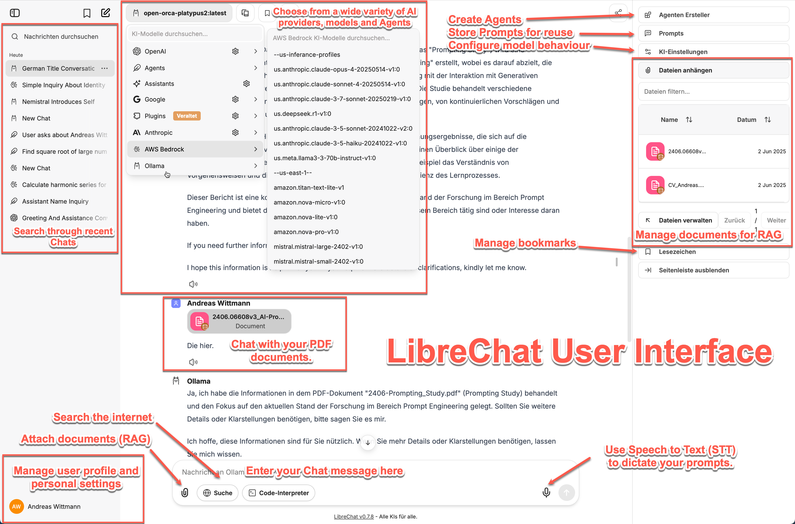
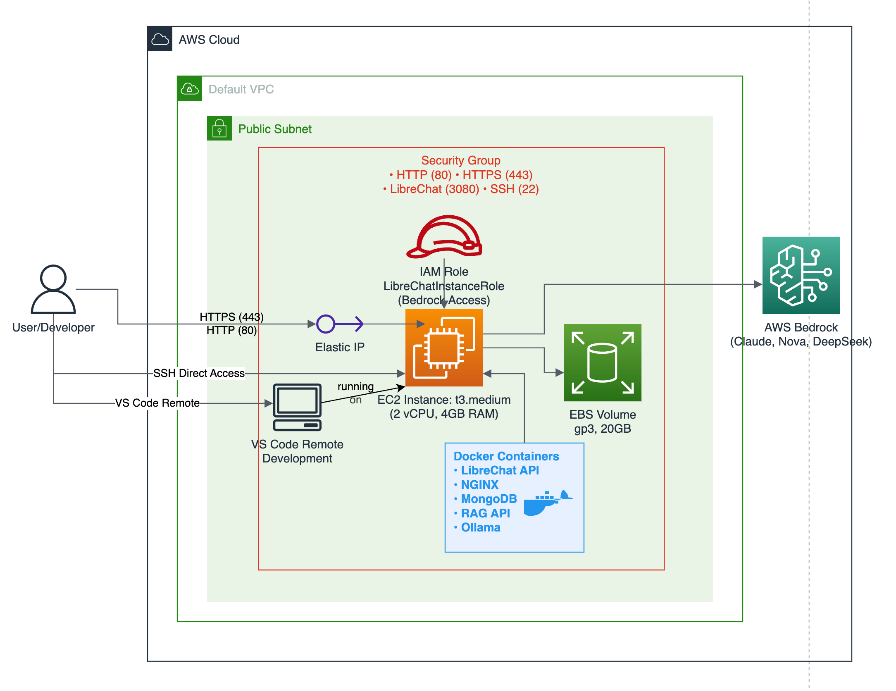
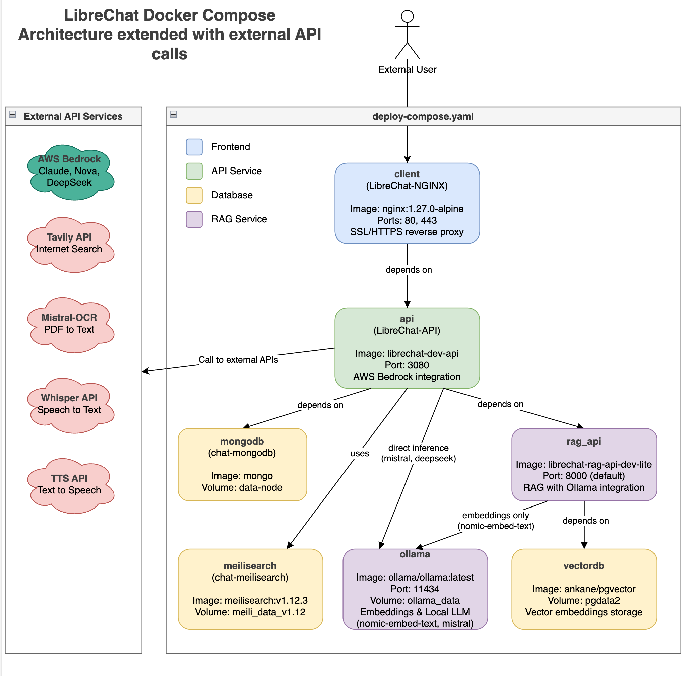

# Private AI - Self-Hosted LibreChat with Complete Data Control

A containerized LibreChat deployment providing flexible privacy controls for AI interactions. Choose between fully local operation or hybrid cloud integration while maintaining complete control over your data and conversations.

This project showcases a **live-scripting documentation approach** using Emacs Org-mode, where the complete deployment guide combines executable code blocks with comprehensive narrative, generating both styled HTML and professional PDF outputs from a single source.

## Project Motivation

Current AI landscape developments create compelling reasons for self-hosted alternatives to cloud-only AI services. Vendor lock-in emerges as organizations become dependent on specific AI providers, limiting flexibility and potentially increasing costs over time. Privacy concerns intensify as sensitive data processing requirements conflict with external API usage, particularly in regulated industries or when handling confidential information.

The rapid progression of AI capabilities demands flexible infrastructure that can adapt to new models, providers, and deployment strategies without complete system redesigns. This project addresses these challenges by establishing a platform-agnostic foundation that supports multiple AI providers while maintaining the option for complete local operation when external dependencies are unacceptable.

Self-hosted deployment eliminates data transmission to third-party services, provides audit trails for compliance requirements, and enables customization impossible with managed AI services. The architecture supports scaling from individual use to enterprise deployment while preserving the ability to switch between local and cloud-based models based on changing requirements or availability.

## Quick Start

1. **Prerequisites**: AWS account with Bedrock access, Terraform, AWS CLI
2. **Deploy**: Follow the complete workflow in [`librechat-aws-deployment.org`](librechat-aws-deployment.org)
3. **Access**: HTTPS-enabled LibreChat with multiple AI models

## Live-Scripting Documentation

This project uses **live-scripting** methodology for executable documentation. Code blocks can be executed directly in Emacs or copied to any terminal for reproducible deployment.

**Complete methodology details**: See [The Live-Scripting Methodology](librechat-aws-deployment.org#the-live-scripting-methodology) section in the deployment guide.

## LibreChat User Interface

LibreChat provides an enterprise-grade conversational AI interface that combines multiple AI providers, advanced document processing, and comprehensive user management capabilities. The platform delivers a unified experience across different AI models while maintaining complete control over data flow and processing.

*Figure 1: LibreChat user interface showing key features including multi-provider model selection, agent management, document processing capabilities, chat history search, and integrated RAG functionality for PDF document interaction.*

### Core Capabilities

**Multi-Provider AI Integration**: The interface provides seamless access to diverse AI providers and models through a unified selection system. Users can choose from local Ollama models, AWS Bedrock services, OpenAI, Anthropic, and other providers without switching interfaces or managing separate API configurations.

**Intelligent Agent System**: Create and configure specialized AI agents with custom behaviors, system prompts, and model parameters. Store reusable prompt templates for consistent interactions across different use cases. The agent system enables workflow automation and standardized responses for specific domains or tasks.

**Advanced Document Processing**: Integrated Retrieval-Augmented Generation (RAG) enables direct interaction with PDF documents and other file types. Upload documents to create searchable knowledge bases and engage in contextual conversations with document content while maintaining data privacy through local processing.

**Professional Workflow Features**: Comprehensive chat history with search functionality, conversation bookmarking for important discussions, and internet search integration for real-time information retrieval. Speech-to-text capabilities (available but not showcased in this project) enable hands-free operation and accessibility support.

**Enterprise User Management**: Robust user profile management with personal settings, conversation organization, and administrative controls. The interface supports multi-user deployments while maintaining individual privacy boundaries and access controls.

The interface demonstrates production-ready design principles with intuitive navigation, responsive layout, and comprehensive feature integration that scales from individual use to enterprise deployment scenarios.

## Architecture Overview

Two privacy configurations are demonstrated in this project:

- **Fully Local**: Ollama models only, no external API calls, complete air-gap capability
- **Hybrid**: AWS Bedrock for reasoning + local Ollama for document processing

## Architecture Diagrams

### AWS Infrastructure Architecture

*Figure 2: AWS cloud infrastructure architecture showing EC2 instance deployment with security groups, Elastic IP configuration, and IAM role permissions for secure Bedrock model access.*

The AWS infrastructure diagram illustrates the complete cloud deployment topology. The setup uses a single EC2 instance in a public subnet with an Elastic IP for consistent access. Security groups restrict network access to specific ports (SSH, HTTP/HTTPS) from authorized IP addresses. An IAM role provides the necessary permissions for AWS Bedrock model access while maintaining least-privilege security principles.

Key infrastructure components include:
- **EC2 Instance**: t3.medium or larger running Amazon Linux 2023
- **Elastic IP**: Static addressing for reliable DNS configuration  
- **Security Groups**: Network-level access control for SSH (22), HTTP (80), HTTPS (443)
- **IAM Role**: Scoped permissions for Bedrock model invocation

### Docker Container Architecture

*Figure 3: Docker container architecture demonstrating service orchestration with LibreChat application container, MongoDB database, Nginx reverse proxy with SSL termination, and optional Ollama containers for local AI model serving.*

The container architecture diagram shows the Docker Compose service orchestration and internal networking. LibreChat runs as the primary application container, with MongoDB providing persistent storage for conversations and user data. Nginx handles SSL termination and reverse proxy functionality. Optional Ollama containers enable local model serving for privacy-focused deployments.

Container network topology:
- **LibreChat**: Main application on internal Docker network
- **MongoDB**: Database persistence with volume mounting
- **Nginx**: SSL termination and reverse proxy (ports 80/443)
- **Ollama** (optional): Local model serving for embedding generation

The original DrawIO source files are available in the `diagrams/` folder and can be edited with [diagrams.net](https://app.diagrams.net) or the VS Code Plugin for modifications.

## Instance Type Progression

The deployment uses three progressively more powerful instance types to accommodate different operational phases and computational requirements. Each instance type serves a specific purpose in the development and scaling of the AI platform.

### Instance Specifications

| Instance Type | vCPUs | Memory | GPU | GPU Memory | Network Performance | Storage | Primary Use Case |
|---------------|-------|---------|-----|------------|-------------------|---------|------------------|
| **t3.medium** | 2 | 4 GB | None | - | Up to 5 Gbps | EBS-optimized | Initial deployment, basic LibreChat functionality |
| **g4dn.xlarge** | 4 | 16 GB | 1x NVIDIA T4 | 16 GB | Up to 25 Gbps | 125 GB NVMe SSD | GPU-accelerated embeddings, small model inference |
| **g6.12xlarge** | 48 | 192 GB | 4x NVIDIA L4 | 96 GB total (24 GB each) | 50 Gbps | 3.76 TB NVMe SSD | Large model inference, multi-user deployment |

### Deployment Phases

**Phase 1 - Basic Deployment (t3.medium):**
The t3.medium instance provides sufficient resources for initial LibreChat deployment, Docker container orchestration, and basic functionality testing. This burstable performance instance handles web interface serving, user authentication, and lightweight chat operations with cloud-based models. The 4 GB memory and 2 vCPUs accommodate MongoDB, Nginx, and LibreChat containers without GPU requirements.

**Phase 2 - Local AI Integration (g4dn.xlarge):**
The g4dn.xlarge upgrade introduces GPU acceleration capabilities through a single NVIDIA T4 GPU with 16 GB VRAM. This configuration enables local Ollama model deployment for document embedding generation and small language model inference. The increased system memory (16 GB) and compute resources (4 vCPUs) support both containerized applications and GPU-accelerated AI workloads.

**Phase 3 - Production Scale (g6.12xlarge):**
The g6.12xlarge instance provides enterprise-grade performance with four NVIDIA L4 Tensor Core GPUs and 96 GB total GPU memory. This configuration supports large language model inference, complex reasoning tasks, and multi-user environments serving 1-20 concurrent users. The substantial system resources (48 vCPUs, 192 GB RAM) enable simultaneous operation of multiple AI models and comprehensive document processing workflows.

### Performance Characteristics

Testing reveals distinct performance profiles across instance types. The t3.medium handles basic LibreChat operations but encounters limitations with local AI model deployment. The g4dn.xlarge enables practical local inference with models up to 8B parameters, though larger models require longer processing times. The g6.12xlarge configuration delivers production-ready performance for models up to 32B parameters with responsive inference times suitable for real-time applications.

The instance progression demonstrates scalable architecture design, allowing cost-effective development on smaller instances while providing clear upgrade paths for production deployment requirements.

## Privacy Configuration Options

| Configuration | Models | External Dependencies | Primary Use Cases |
|---------------|--------|----------------------|-------------------|
| **Fully Local** | Ollama only | None | Sensitive data, offline environments |
| **Hybrid** | Bedrock + Ollama | AWS Bedrock API only | General use with document privacy |

## Prerequisites

- AWS account with Bedrock access (may require 1-2 days for activation)
- Terraform installed and configured
- AWS CLI configured with appropriate permissions
- SSH key pair for EC2 access

## Repository Structure

- `librechat-aws-deployment.org` - Complete executable deployment workflow
- `terraform/` - AWS infrastructure automation
- `configs/` - Docker Compose and nginx configuration templates
- `diagrams/` - Architecture diagrams and documentation

## License

MIT License - see [LICENSE](LICENSE) file.

---

*Privacy-focused AI deployment with configurable data sovereignty levels.*
